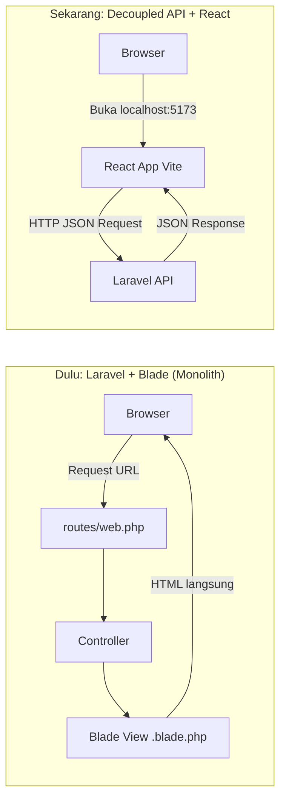
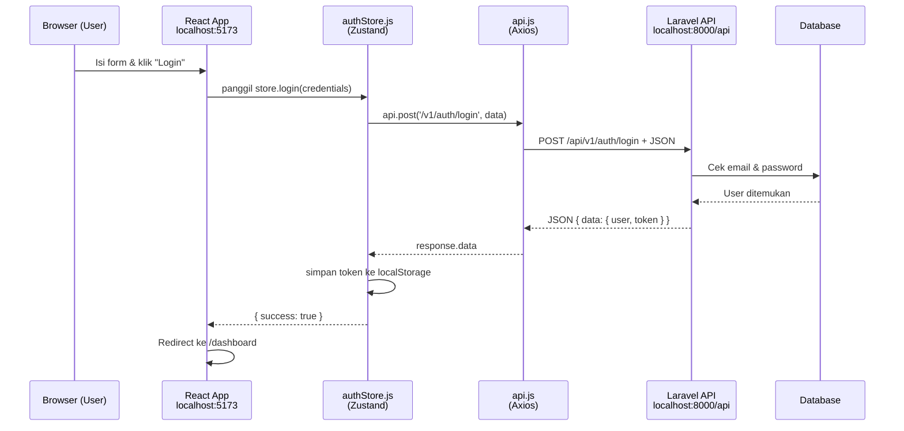
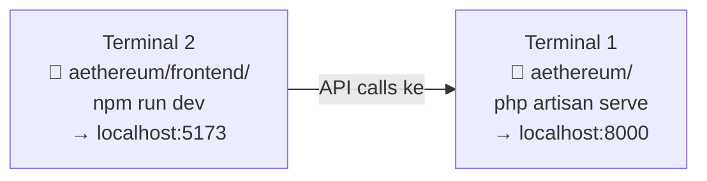

# Alur Kerja Proyek Aethereum — Laravel API + React

## Gambaran Besar: Perbedaan dengan Laravel + Blade



> [!IMPORTANT]
> **Perbedaan utama**: Laravel sekarang **tidak menghasilkan HTML sama sekali**. Laravel hanya menerima request dan mengembalikan **JSON**. React yang mengurus tampilan di browser.

---

## Struktur Proyek

```
aethereum/               ← ROOT proyek
│
├── app/                 ← BACKEND (Laravel)
│   └── Http/
│       └── Controllers/
│           └── Api/     ← Semua controller ada di sini
│               ├── AuthController.php
│               └── HealthController.php
│
├── routes/
│   ├── api.php          ← Semua endpoint API (yang diakses React)
│   └── web.php          ← Hanya untuk health check, tidak ada Blade
│
├── database/            ← Migration, seeder (sama seperti biasa)
│
└── frontend/            ← FRONTEND (React + Vite) — TERPISAH!
    └── src/
        ├── main.jsx         ← Entry point
        ├── App.jsx          ← Layout utama (navbar, footer)
        ├── router.jsx       ← Routing halaman (setara routes/web.php di Blade)
        ├── pages/           ← Halaman-halaman (setara views/ di Blade)
        │   ├── LoginPage.jsx
        │   └── RegisterPage.jsx
        ├── services/
        │   └── api.js       ← Axios client (semua request ke Laravel lewat sini)
        ├── stores/
        │   └── authStore.js ← State global (Zustand) — setara Session di Blade
        └── components/      ← Komponen UI yang bisa dipakai ulang
```

---

## Alur Request Lengkap — Contoh: Login



---

## Komponen Kunci — Penjelasan Sederhana

### 1. [routes/api.php](file:///c:/Users/LENOVO/Herd/aethereum/routes/api.php) — Pintu Masuk Backend

Setara dengan [routes/web.php](file:///c:/Users/LENOVO/Herd/aethereum/routes/web.php) di Laravel+Blade tapi **khusus API**. Semua URL yang diakses React didaftarkan di sini.

```php
// Public (tanpa login)
Route::post('/v1/auth/register', [AuthController::class, 'register']);
Route::post('/v1/auth/login',    [AuthController::class, 'login']);

// Protected (perlu token Bearer)
Route::middleware('auth:sanctum')->group(function () {
    Route::post('/v1/auth/logout', [AuthController::class, 'logout']);
    Route::get('/user', fn(Request $r) => $r->user());
});
```

### 2. [AuthController.php](file:///c:/Users/LENOVO/Herd/aethereum/app/Http/Controllers/Api/AuthController.php) — Otak Backend

Controller seperti biasa, tapi **tidak pernah return `view()`** — selalu return JSON.

```php
// ✅ Sekarang (API)
return $this->success(['user' => $user, 'token' => $token], 'Login successful');

// ❌ Dulu (Blade)
return view('dashboard', compact('user'));
```

### 3. [frontend/src/services/api.js](file:///c:/Users/LENOVO/Herd/aethereum/frontend/src/services/api.js) — Jembatan React ↔ Laravel

Instance Axios yang sudah dikonfigurasi. **Semua request ke backend wajib lewat sini.**

```js
// Otomatis tambahkan token di setiap request
api.interceptors.request.use((config) => {
    const token = localStorage.getItem('token');
    if (token) config.headers.Authorization = `Bearer ${token}`;
    return config;
});
```

### 4. [frontend/src/stores/authStore.js](file:///c:/Users/LENOVO/Herd/aethereum/frontend/src/stores/authStore.js) — Pengganti Session

Di Blade, state user disimpan di **PHP Session**. Di React, state disimpan di **Zustand store** yang persist di `localStorage`.

| Blade (dulu) | React Zustand (sekarang) |
|---|---|
| `Auth::user()` | `useAuthStore(s => s.user)` |
| `session()->put('key', val)` | `localStorage.setItem('token', val)` |
| `Auth::check()` | `store.token !== null` |

### 5. [frontend/src/router.jsx](file:///c:/Users/LENOVO/Herd/aethereum/frontend/src/router.jsx) — Pengganti [routes/web.php](file:///c:/Users/LENOVO/Herd/aethereum/routes/web.php)

Di Blade, routing halaman diatur di [routes/web.php](file:///c:/Users/LENOVO/Herd/aethereum/routes/web.php). Di React, routing diatur di [router.jsx](file:///c:/Users/LENOVO/Herd/aethereum/frontend/src/router.jsx) menggunakan React Router.

```jsx
// Setara dengan Route::get('/dashboard', ...) di web.php
<Route path="dashboard" element={<Dashboard />} />
<Route path="login"     element={<LoginPage />} />
```

---

## Cara Menambah Fitur Baru (Alur Kerja Harian)

### Contoh: Menambah fitur "Profile User"

**Step 1 — Backend: Buat endpoint di [routes/api.php](file:///c:/Users/LENOVO/Herd/aethereum/routes/api.php)**
```php
Route::middleware('auth:sanctum')->group(function () {
    Route::get('/v1/profile', [ProfileController::class, 'show']);
    Route::put('/v1/profile', [ProfileController::class, 'update']);
});
```

**Step 2 — Backend: Buat Controller**
```bash
php artisan make:controller Api/ProfileController
```
```php
// app/Http/Controllers/Api/ProfileController.php
public function show(Request $request): JsonResponse {
    return $this->success($request->user());
}
```

**Step 3 — Frontend: Panggil API dari React**
```js
// Di dalam komponen atau store
const response = await api.get('/v1/profile');
const user = response.data.data;
```

**Step 4 — Frontend: Buat halaman baru**
```jsx
// frontend/src/pages/ProfilePage.jsx
export default function ProfilePage() { ... }
```

**Step 5 — Frontend: Daftarkan di router**
```jsx
// frontend/src/router.jsx
import ProfilePage from './pages/ProfilePage';
<Route path="profile" element={<ProfilePage />} />
```

---

## Cara Menjalankan Proyek (Dua Terminal)



| Terminal | Direktori | Perintah | URL |
|---|---|---|---|
| 1 (Backend) | `aethereum/` | `php artisan serve` | `localhost:8000` |
| 2 (Frontend) | `aethereum/frontend/` | `npm run dev` | `localhost:5173` |

> [!TIP]
> Buka browser ke `localhost:5173` saja. React secara otomatis akan memanggil Laravel di `localhost:8000` sesuai konfigurasi `VITE_API_URL` di [frontend/.env](file:///c:/Users/LENOVO/Herd/aethereum/frontend/.env).

---

## Format Response JSON dari Laravel

Semua response dari backend mengikuti format standar berkat trait `ApiResponse`:

```json
{
    "success": true,
    "message": "Login successful",
    "data": {
        "user": { "id": 1, "name": "Budi", "email": "budi@mail.com" },
        "token": "1|abc123xyz..."
    }
}
```

Di React, datanya diambil dengan:
```js
const payload = response.data.data; // ← ambil dari .data.data
const user  = payload.user;
const token = payload.token;
```

